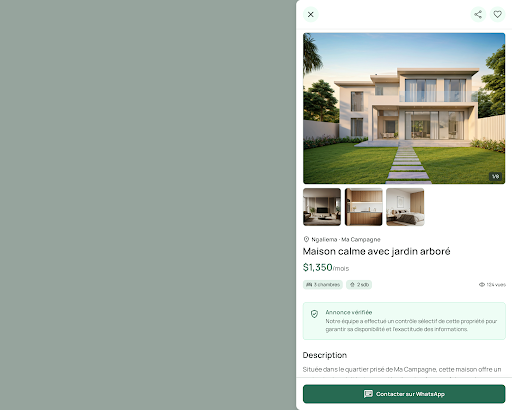

# Stitch Review: Maison Marketplace Prototype

## Provenance

Stitch project:

- Title: `Maison Marketplace Prototype`
- ID: `12266912457141734632`

Directly inspected screen:

- Title: `Détail de l'annonce - Ngaliema`
- ID: `da852d7c7da146178acd14d497a001a5`
- Imported HTML: [`stitch-imports/detail-ngaliema/screen.html`](stitch-imports/detail-ngaliema/screen.html)
- Imported screenshot: [`stitch-imports/detail-ngaliema/screen.png`](stitch-imports/detail-ngaliema/screen.png)
- Imported image placeholders: `stitch-imports/detail-ngaliema/property-01.jpg` through `property-04.jpg`

The Stitch project also contains:

- `Maison - Accueil et Recherche`
- `États de recherche`
- `Identification avant WhatsApp`
- `Tableau de bord - Patrick Ilunga`
- `Publier un bien`

## Screenshot

## What To Adopt

| Stitch decision | Adoption |
|---|---|
| Right-side desktop drawer and full-screen mobile detail | Adopt |
| Sticky top controls | Adopt |
| Main `4:3` photo with thumbnail strip and image count | Adopt |
| Compact facts immediately below price | Adopt |
| Dedicated verification explanation box | Adopt with corrected copy |
| Commissionnaire identity block before contact | Adopt |
| Visually secondary report action | Adopt |
| Sticky WhatsApp CTA | Adopt |
| Manrope typography and restrained rounded geometry | Adopt |

## What To Correct

| Stitch output | Correction |
|---|---|
| Verification copy claims a guarantee of availability and accuracy | Replace with narrow canonical copy from `DESIGN.md` and `EXPERIENCE.md` |
| Availability freshness is not prominent enough | Add explicit status and last-update timestamp in detail |
| Generated mint surfaces dominate the system tokens | Reserve mint for trust surfaces; use warm-paper base globally |
| Property imagery is highly polished and upscale | Test ordinary credible inventory; use real photos in production |
| `transition-all` appears in generated HTML | Use explicit transition properties in implementation |
| Generated HTML loads Tailwind CDN and Google assets directly | Treat as mock code only, not production architecture |
| Icon family is Material Symbols while local prototype uses custom SVG outlines | Choose one outlined family during implementation and keep it consistent |

## Canonical Documents

The design agent should read these in order:

1. [`../PRODUCT.md`](../PRODUCT.md)
2. [`../DESIGN.md`](../DESIGN.md)
3. [`../EXPERIENCE.md`](../EXPERIENCE.md)
4. This Stitch review

The Markdown spines win if a generated mock conflicts with product trust boundaries, accessibility rules, or state behavior.
